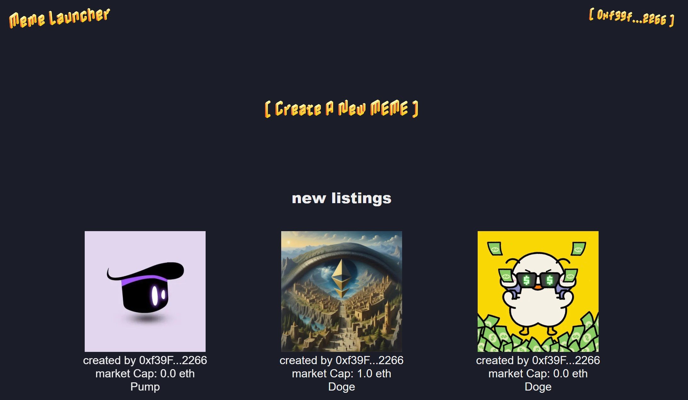

## About this Project

MemeLauncher is a meme launch platform inspired by Pump.fun, where users can create their memes and buy memes. Once the meme is ready to be launched, it will be launched to the `Uniswap` dex. We also provide the front-end for users to interact with the smart contract.



## Built With

- Solidity
- OpenZeppelin
- Foundry
- Uniswap v4
- Next.js
- Ethers.js

## Getting Started

### Prerequisites

- [git](https://git-scm.com/book/en/v2/Getting-Started-Installing-Git)
  - You'll know you did it right if you can run `git --version` and you see a response like `git version x.x.x`
- [foundry](https://getfoundry.sh/)
  - You'll know you did it right if you can run `forge --version` and you see a response like `forge 0.2.0 (816e00b 2023-03-16T00:05:26.396218Z)`
- [Node.js](https://nodejs.org/en/)
  - You'll know you did it right if you can run `node --version` and you see a response like `v14.17.0`
- [npm](https://www.npmjs.com/get-npm)
  - You'll know you did it right if you can run `npm --version` and you see a response like `6.14.13`

### Quickstart

```
git clone https://github.com/cqlyj/MemeLauncher.git
cd MemeLauncher
make
npm install
```

## Usage

1. Start the local blockchain

```
anvil
```

2. Deploy the smart contract

```
make build
make deploy-anvil
```

3. Start the front-end

```
npm run dev
```

4. Open your browser and go to `http://localhost:3000`
5. Connect your wallet and start using the platform

## Testing

```
forge test
```

## Test Coverage

```
forge coverage
```

and for coverage based testing:

```
forge coverage --report debug
```

## Static Analysis

### Slither

```
make slither
```

### Aderyn

```
make aderyn
```

## License

This project is licensed under the MIT License - see the [LICENSE](LICENSE) file for details.
